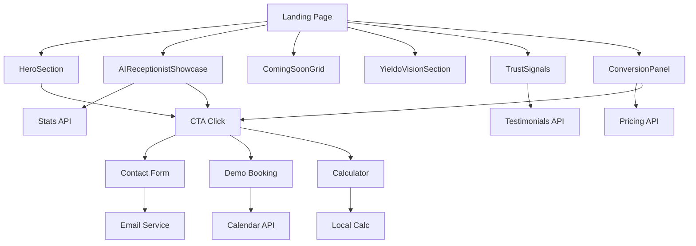

# Component Specifications - Landing Page

## Component Inventory

### 1. HeroSection Component

**Purpose**: Capture attention and communicate value proposition immediately

**Location**: `/src/components/landing/hero/HeroSection.tsx`

**Props Interface**:
```typescript
interface HeroSectionProps {
  variant?: 'default' | 'product-focused' | 'minimal'
  showDemo?: boolean
  showStats?: boolean
  ctaVariant?: 'dual' | 'single'
  backgroundAnimation?: 'particles' | 'gradient' | 'none'
  className?: string
}
```

**Visual Structure**:
```
┌─────────────────────────────────────────────────────────┐
│  NAVBAR (Fixed)                                         │
├─────────────────────────────────────────────────────────┤
│                                                         │
│  ┌─────────────────┐  ┌──────────────────────────┐    │
│  │                 │  │                          │    │
│  │  YIELDO LOGO    │  │   AI RECEPTIONIST       │    │
│  │  + TAGLINE      │  │   ANIMATED SHOWCASE     │    │
│  │                 │  │                          │    │
│  │  MAIN HEADLINE  │  │   • Phone mockup        │    │
│  │  SUB-HEADLINE   │  │   • Live conversation   │    │
│  │                 │  │   • Visual indicators   │    │
│  │  [CTA Primary]  │  │                          │    │
│  │  [CTA Secondary]│  │                          │    │
│  │                 │  │                          │    │
│  │  ✓ Quick Facts  │  │                          │    │
│  │                 │  │                          │    │
│  └─────────────────┘  └──────────────────────────┘    │
│                                                         │
└─────────────────────────────────────────────────────────┘
```

**Responsive Behavior**:
- Desktop (1024px+): 2-column layout, full animations
- Tablet (640px-1023px): 2-column stacked, reduced animations
- Mobile (<640px): Single column, static demo image

**Key Features**:
- Animated headline with typewriter effect
- Interactive product showcase on right
- Dual CTA buttons (primary: signup, secondary: demo)
- Trust indicators below CTAs
- Smooth scroll to sections

**Dependencies**:
- `TypewriterText.tsx`
- `AnimatedBackground.tsx`
- `AIReceptionistShowcase.tsx`
- Framer Motion for animations

---

### 2. AIReceptionistShowcase Component

**Purpose**: Visually demonstrate AI receptionist in action

**Location**: `/src/components/landing/products/AIReceptionistShowcase.tsx`

**Props Interface**:
```typescript
interface AIReceptionistShowcaseProps {
  variant?: 'featured' | 'compact' | 'card'
  showLiveDemo?: boolean
  autoplay?: boolean
  showStats?: boolean
  interactive?: boolean
  className?: string
}
```

**Visual Structure**:
```
┌──────────────────────────────────────┐
│  🎨 Product Badge: "Available Now"  │
│                                      │
│  ┌────────────────────────────┐     │
│  │  📱 PHONE MOCKUP           │     │
│  │                            │     │
│  │  ┌──────────────────────┐ │     │
│  │  │ Incoming Call...     │ │     │
│  │  │ [Anna Kowalska]      │ │     │
│  │  │                      │ │     │
│  │  │ 🔊 AI: "Dzień dobry" │ │     │
│  │  │ 💬 Client: "Termin?" │ │     │
│  │  └──────────────────────┘ │     │
│  │                            │     │
│  │  [🎤 Audio Waveform]       │     │
│  └────────────────────────────┘     │
│                                      │
│  📊 Live Stats:                      │
│  • 42 active sessions                │
│  • 2.8s avg response                 │
│  • 99.9% uptime                      │
│                                      │
│  [Learn More] [Try Demo]             │
└──────────────────────────────────────┘
```

**Key Features**:
- Animated phone mockup with realistic UI
- Live conversation transcript simulation
- Audio waveform animation during "speech"
- Real-time statistics ticker
- "Available Now" badge with pulse animation
- Click-to-expand demo modal

**States**:
- `idle`: Static display with stats
- `demo`: Playing conversation simulation
- `interactive`: User can trigger actions

**Dependencies**:
- `HeroPhoneMockup.tsx` (enhanced)
- `AnimatedStatCard.tsx`
- Audio waveform library (lightweight)

---

### 3. ComingSoonGrid Component

**Purpose**: Showcase future products and build anticipation

**Location**: `/src/components/landing/products/ComingSoonGrid.tsx`

**Props Interface**:
```typescript
interface ComingSoonProduct {
  id: string
  name: string
  description: string
  icon: React.ComponentType
  launchDate?: Date
  estimatedDate?: string
  features: string[]
  status: 'planned' | 'development' | 'beta'
  waitlistEnabled?: boolean
}

interface ComingSoonGridProps {
  products: ComingSoonProduct[]
  layout?: 'grid' | 'carousel' | 'list'
  showTimeline?: boolean
  enableWaitlist?: boolean
  columns?: 2 | 3 | 4
  className?: string
}
```

**Visual Structure**:
```
┌─────────────────────────────────────────────────────────────┐
│  📋 Section Header                                          │
│  "Coming Soon: More AI Solutions"                           │
│                                                             │
│  ┌──────────────┐  ┌──────────────┐  ┌──────────────┐     │
│  │ 🌐 DIGITAL   │  │ 🔍 GRANT     │  │ 📝 WEBSITE   │     │
│  │ PRESENCE     │  │ AUTOMATION   │  │ CREATION     │     │
│  │              │  │              │  │              │     │
│  │ [Coming Q2]  │  │ [Coming Q3]  │  │ [Coming Q2]  │     │
│  │              │  │              │  │              │     │
│  │ ✓ Feature 1  │  │ ✓ Feature 1  │  │ ✓ Feature 1  │     │
│  │ ✓ Feature 2  │  │ ✓ Feature 2  │  │ ✓ Feature 2  │     │
│  │ ✓ Feature 3  │  │ ✓ Feature 3  │  │ ✓ Feature 3  │     │
│  │              │  │              │  │              │     │
│  │ [Join Wait]  │  │ [Join Wait]  │  │ [Join Wait]  │     │
│  └──────────────┘  └──────────────┘  └──────────────┘     │
│                                                             │
│  ═══════════════════════════════════════════════════════   │
│  Timeline: Q2 2025 → Q3 2025 → Q4 2025                     │
└─────────────────────────────────────────────────────────────┘
```

**Key Features**:
- Status badges (Planned/Development/Beta)
- Estimated launch dates
- Feature previews
- Waitlist signup integration
- Hover effects showing more details
- Optional timeline visualization

**Card States**:
- `planned`: Grayed out with "Coming Soon" badge
- `development`: Yellow badge "In Development"
- `beta`: Green badge "Beta Available"

**Dependencies**:
- Card component from UI library
- Badge component
- Modal for waitlist signup
- Timeline component (optional)

---

### 4. YieldoVisionSection Component

**Purpose**: Communicate company mission and AI-first approach

**Location**: `/src/components/landing/vision/YieldoVisionSection.tsx`

**Props Interface**:
```typescript
interface YieldoVisionSectionProps {
  variant?: 'detailed' | 'compact'
  showMission?: boolean
  showValues?: boolean
  showTeam?: boolean
  showTimeline?: boolean
  className?: string
}
```

**Visual Structure**:
```
┌─────────────────────────────────────────────────────────────┐
│  🎯 YIELDO VISION                                           │
│                                                             │
│  ┌─────────────────────────────────────────────────────┐   │
│  │  Mission Statement                                  │   │
│  │  "Empower businesses with AI solutions that         │   │
│  │   actually work and deliver measurable results"     │   │
│  └─────────────────────────────────────────────────────┘   │
│                                                             │
│  ┌────────────┐  ┌────────────┐  ┌────────────┐          │
│  │ 🤖 AI-FIRST │  │ 📊 DATA    │  │ 🚀 RESULTS │          │
│  │            │  │ -DRIVEN    │  │            │          │
│  │ We build   │  │            │  │ Measurable │          │
│  │ with AI at │  │ Every      │  │ ROI within │          │
│  │ the core   │  │ decision   │  │ weeks      │          │
│  └────────────┘  └────────────┘  └────────────┘          │
│                                                             │
│  🏢 Industries We Serve:                                    │
│  • Healthcare • Professional Services • Retail              │
│  • Home Services • Hospitality • More...                    │
│                                                             │
│  📈 Our Journey:                                            │
│  2023: Founded → 2024: AI Receptionist → 2025: Full Suite │
└─────────────────────────────────────────────────────────────┘
```

**Key Features**:
- Clear mission statement
- Core values visualization
- Industry expertise showcase
- Company timeline (optional)
- Team highlights (optional)
- Social proof integration

**Content Sections**:
1. Mission & Vision (hero text)
2. Core Values (icon cards)
3. Industry Expertise (badge grid)
4. Company Timeline (optional)
5. Team Preview (optional)

---

### 5. TrustSignals Component

**Purpose**: Build credibility through testimonials, stats, and social proof

**Location**: `/src/components/landing/trust/TrustSignals.tsx`

**Props Interface**:
```typescript
interface Testimonial {
  id: string
  author: string
  role: string
  company: string
  content: string
  rating: number
  avatar?: string
  verified?: boolean
}

interface TrustSignalsProps {
  testimonials?: Testimonial[]
  statistics?: Statistic[]
  certifications?: Certification[]
  caseStudies?: CaseStudy[]
  variant?: 'comprehensive' | 'compact'
  autoRotate?: boolean
  className?: string
}
```

**Visual Structure**:
```
┌─────────────────────────────────────────────────────────────┐
│  🏆 TRUSTED BY BUSINESSES ACROSS POLAND                     │
│                                                             │
│  ┌──────────────────────────────────────────────────────┐  │
│  │  Testimonials Carousel                               │  │
│  │                                                      │  │
│  │  "AI Sekretarka saved us 20+ hours per week"        │  │
│  │  ⭐⭐⭐⭐⭐                                              │  │
│  │  - Jan Kowalski, Owner at Klinika XYZ               │  │
│  │                                                      │  │
│  │  [◀] [●] [●] [●] [▶]                                  │  │
│  └──────────────────────────────────────────────────────┘  │
│                                                             │
│  📊 By The Numbers:                                         │
│  ┌─────────┐ ┌─────────┐ ┌─────────┐ ┌─────────┐         │
│  │   20+   │ │ 10,000+ │ │  99.9%  │ │   4.8   │         │
│  │ Clients │ │  Calls  │ │ Uptime  │ │ Rating  │         │
│  └─────────┘ └─────────┘ └─────────┘ └─────────┘         │
│                                                             │
│  🔒 Security & Compliance:                                  │
│  [GDPR] [ISO 27001] [SOC 2] [🇵🇱 Polish Data Center]       │
│                                                             │
│  📚 Case Studies:                                           │
│  → Dental Clinic: 35% more bookings                        │
│  → Law Office: 15 hrs/week saved                           │
│  → Salon: 98% call answer rate                             │
└─────────────────────────────────────────────────────────────┘
```

**Key Features**:
- Rotating testimonial carousel
- Verified badges on testimonials
- Live statistics counters
- Security certification badges
- Case study previews with links
- Industry-specific filters

**Sub-Components**:
- `TestimonialCard` - Individual testimonial display
- `StatisticCounter` - Animated number counter
- `CertificationBadge` - Security/compliance badges
- `CaseStudyPreview` - Expandable case study card

---

### 6. ConversionPanel Component

**Purpose**: Drive conversions with clear CTAs and comparison data

**Location**: `/src/components/landing/conversion/ConversionPanel.tsx`

**Props Interface**:
```typescript
interface ConversionPanelProps {
  variant: 'pricing' | 'demo' | 'contact' | 'calculator'
  showComparison?: boolean
  showGuarantee?: boolean
  showUrgency?: boolean
  customCTA?: string
  className?: string
}
```

**Visual Structure**:
```
┌─────────────────────────────────────────────────────────────┐
│  💰 PRICING COMPARISON                                      │
│                                                             │
│  ┌──────────────────────────────────────────────────────┐  │
│  │  Traditional Receptionist  vs.  AI Receptionist      │  │
│  │                                                      │  │
│  │  2,000 zł/month               299-999 zł/month      │  │
│  │  40 hrs/week availability     24/7 availability     │  │
│  │  Vacation/sick days           Never takes breaks    │  │
│  │  Training time needed         Ready immediately     │  │
│  │  Human errors                 Consistent quality    │  │
│  │                                                      │  │
│  │         [Choose AI →]                                │  │
│  └──────────────────────────────────────────────────────┘  │
│                                                             │
│  🎁 Launch Offer: First Month 50% Off                       │
│  ⏰ 12 spots left at this price                             │
│                                                             │
│  ✓ 30-day money-back guarantee                             │
│  ✓ No credit card required to start                        │
│  ✓ Cancel anytime, no penalties                            │
│                                                             │
│  [START FREE TRIAL] [SCHEDULE DEMO]                        │
└─────────────────────────────────────────────────────────────┘
```

**Key Features**:
- Side-by-side comparison table
- Pricing calculator integration
- Limited-time offer banners
- Social proof (e.g., "12 businesses signed up today")
- Money-back guarantee badge
- Multiple CTA options
- Urgency indicators (spots left, timer)

**Conversion Elements**:
1. **Primary CTA**: Start trial/Sign up
2. **Secondary CTA**: Schedule demo
3. **Tertiary CTA**: Contact sales
4. **Trust Signals**: Guarantees, no credit card, cancel anytime

---

### 7. Enhanced Navbar Component

**Purpose**: Provide easy navigation while promoting conversion

**Location**: `/src/components/landing/navigation/EnhancedNavbar.tsx`

**Props Interface**:
```typescript
interface EnhancedNavbarProps {
  showProductDropdown?: boolean
  showCTA?: boolean
  transparent?: boolean
  variant?: 'default' | 'sticky' | 'floating'
  className?: string
}
```

**Visual Structure**:
```
┌─────────────────────────────────────────────────────────────┐
│  [LOGO]  Products ▼  Solutions  Pricing  Contact  [CTA]   │
│                                                             │
│  Product Dropdown (on hover):                              │
│  ┌────────────────────────────────────────────────────┐    │
│  │ ✓ AI Receptionist - Available Now                 │    │
│  │ ⏰ Digital Presence - Coming Q2                    │    │
│  │ ⏰ Grant Automation - Coming Q3                    │    │
│  │ ⏰ Website Creation - Coming Q2                    │    │
│  └────────────────────────────────────────────────────┘    │
└─────────────────────────────────────────────────────────────┘
```

**Key Features**:
- Sticky positioning on scroll
- Product dropdown menu
- Mobile hamburger menu
- CTA button always visible
- Progress indicator (optional)
- Search functionality (future)

**Responsive Behavior**:
- Desktop: Full menu + dropdown
- Tablet: Condensed menu
- Mobile: Hamburger menu

---

## Component Data Flow



## Shared Component Library

### Reusable Across Landing Page

**Layout Components**:
- `Section` - Standardized section wrapper
- `Container` - Max-width container with padding
- `Grid` - Responsive grid system
- `Stack` - Vertical/horizontal stacking

**Content Components**:
- `Heading` - Typography with variants
- `Text` - Body text with sizes
- `Badge` - Status indicators
- `Card` - Content cards with variants

**Interactive Components**:
- `Button` - CTA buttons with variants
- `Input` - Form inputs
- `Select` - Dropdown selects
- `Modal` - Overlay dialogs

**Media Components**:
- `Image` - Optimized images
- `Video` - Video player with controls
- `Icon` - Icon library integration

## Performance Optimization

### Code Splitting Strategy

```typescript
// Lazy load heavy components
const AIReceptionistShowcase = dynamic(
  () => import('@/components/landing/products/AIReceptionistShowcase'),
  {
    loading: () => <ShowcaseSkeleton />,
    ssr: true // Server render for SEO
  }
)

const ConversionPanel = dynamic(
  () => import('@/components/landing/conversion/ConversionPanel'),
  {
    loading: () => <PanelSkeleton />,
    ssr: false // Client only, below fold
  }
)
```

### Image Optimization

```typescript
// Responsive image sizes
<Image
  src="/hero-ai-receptionist.jpg"
  alt="AI Receptionist Demo"
  sizes="(max-width: 640px) 100vw, (max-width: 1024px) 50vw, 800px"
  width={1600}
  height={900}
  priority={true} // Above fold
  quality={85}
/>
```

## Testing Strategy

### Component Testing Checklist

For each component:
- [ ] Unit tests for logic
- [ ] Visual regression tests
- [ ] Accessibility tests (a11y)
- [ ] Performance tests (bundle size)
- [ ] Cross-browser testing
- [ ] Mobile device testing
- [ ] Storybook documentation

### Example Test Structure

```typescript
// HeroSection.test.tsx
describe('HeroSection', () => {
  it('renders with default props', () => {})
  it('handles CTA clicks correctly', () => {})
  it('displays demo when showDemo is true', () => {})
  it('is accessible via keyboard', () => {})
  it('meets WCAG 2.1 AA standards', () => {})
})
```

---

**Document Version**: 1.0
**Last Updated**: 2025-11-11
**Status**: Component Specifications Complete
