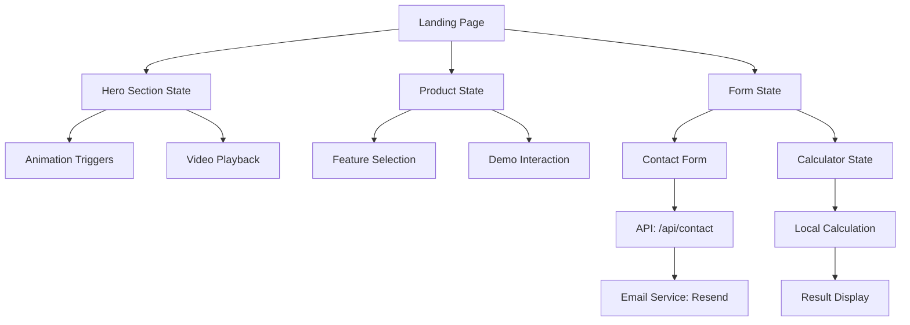

# Landing Page Architecture - Yieldo AI Receptionist

## Executive Summary

This document outlines the comprehensive architecture for redesigning Yieldo's landing page to effectively position the AI receptionist as the flagship product while showcasing the company's broader vision and upcoming solutions.

## Current System Analysis

### Technology Stack
- **Framework**: Next.js 15.3.5 (App Router)
- **React**: 19.0.0
- **Styling**: Tailwind CSS 4 with custom design system
- **UI Components**: Radix UI primitives + custom components
- **Animations**: Framer Motion 12.23.24
- **State Management**: React hooks (client-side)
- **Authentication**: Better Auth 1.3.34 (currently disabled via feature flag)
- **Analytics**: Vercel Analytics
- **Database**: PostgreSQL via Vercel Postgres
- **Payment Processing**: Stripe 19.1.0

### Existing Component Library

**Reusable UI Components** (58+ components):
- Navigation: `navbar.tsx`, `navigation-menu.tsx`, `breadcrumb.tsx`
- Layout: `card.tsx`, `container-scroll-animation.tsx`, `separator.tsx`
- Forms: `button.tsx`, `input.tsx`, `form.tsx`, `select.tsx`
- Feedback: `toast.tsx`, `alert.tsx`, `dialog.tsx`
- Data Display: `table.tsx`, `chart.tsx`, `badge.tsx`

**Custom Feature Components**:
- `AnimatedBackground.tsx` - Dynamic hero backgrounds
- `HeroPhoneMockup.tsx` - Interactive phone UI showcase
- `TypewriterText.tsx` - Animated text effects
- `AnimatedStatCard.tsx` - Live statistics display
- `EnhancedPricingCard.tsx` - Pricing tables
- `LostRevenueCalculator.tsx` - ROI calculator

### Current Page Structure

The application uses a modular page structure:
```
/app
├── page.tsx (Main landing - module selection)
├── ai-sekretarka/page.tsx (AI Receptionist product page)
├── ai-sekretarka-demo/ (Demo components)
├── kalkulator/page.tsx (Calculator tool)
├── digital-presence/page.tsx (Coming soon)
├── google-business/page.tsx (Coming soon)
├── website-creation/page.tsx (Coming soon)
└── dashboard/ (User dashboard - auth-gated)
```

## New Landing Page Architecture

### 1. Component Hierarchy

```
LandingPage (New)
├── Navigation (Existing - navbar.tsx)
├── HeroSection
│   ├── HeroContent
│   │   ├── CompanyBranding
│   │   ├── ValueProposition
│   │   └── PrimaryCTA
│   └── HeroVisual
│       ├── AIReceptionistShowcase (Featured)
│       └── InteractiveDemo
├── AIReceptionistFeature (Primary Focus)
│   ├── ProductOverview
│   ├── KeyBenefits
│   ├── LiveDemo
│   └── SocialProof
├── ComingSoonSection
│   ├── ComingSoonGrid
│   │   ├── DigitalPresenceCard
│   │   ├── GrantAutomationCard
│   │   └── WebsiteCreationCard
│   └── RoadmapTimeline
├── YieldoVisionSection
│   ├── CompanyMission
│   ├── AIFirstApproach
│   └── IndustryExpertise
├── TrustSignalsSection
│   ├── Testimonials
│   ├── Statistics
│   ├── SecurityBadges
│   └── CaseStudies
├── ConversionSection
│   ├── ComparisonTable
│   ├── PricingTeaser
│   └── MultipleCTAs
└── Footer (Enhanced)
    ├── ProductLinks
    ├── CompanyInfo
    ├── ContactDetails
    └── LegalLinks
```

### 2. Data Flow & State Management



#### State Management Strategy

**Client-Side State** (React Hooks):
- UI interactions (menu, modals, accordions)
- Form inputs and validation
- Animation states
- Calculator inputs/outputs

**Server State** (API Routes):
- Contact form submissions
- Newsletter signups
- Analytics tracking

**URL State** (Next.js Router):
- Section anchors (#pricing, #features)
- UTM parameters for marketing
- Feature flags (query params)

### 3. Responsive Design Approach

**Breakpoint Strategy**:
```typescript
const breakpoints = {
  mobile: '0px',      // 320px - 639px
  tablet: '640px',    // 640px - 1023px
  desktop: '1024px',  // 1024px - 1535px
  wide: '1536px'      // 1536px+
}
```

**Mobile-First Components**:
- Stack layouts convert to grid on tablet+
- Navigation collapses to hamburger menu < 768px
- Hero converts from 2-column to single column
- Touch-optimized interactions for mobile

**Progressive Enhancement**:
- Animations disabled on low-power devices
- Video replaced with static images on slow connections
- Lazy loading for below-fold content
- Optimized images with Next.js Image component

### 4. SEO Architecture

**Metadata Strategy**:
```typescript
// Page-level metadata
export const metadata = {
  title: 'Yieldo - AI Solutions for Modern Business',
  description: 'Professional AI Receptionist, Website Creation, and Business Automation',
  keywords: ['AI receptionist', 'business automation', 'Yieldo'],
  openGraph: {
    title: 'Yieldo - AI for Business Growth',
    description: 'Transform your business with AI-powered solutions',
    images: ['/og-landing.jpg'],
  }
}
```

**Structured Data**:
- Organization schema (JSON-LD)
- Product schema for AI Receptionist
- BreadcrumbList for navigation
- FAQ schema for common questions
- LocalBusiness schema (if applicable)

**Performance Targets**:
- First Contentful Paint: < 1.5s
- Largest Contentful Paint: < 2.5s
- Time to Interactive: < 3.5s
- Cumulative Layout Shift: < 0.1

## 5. Component Structure Plan

### New Components to Create

#### `/src/components/landing/` (New Directory)

**HeroSection.tsx**
```typescript
interface HeroSectionProps {
  variant?: 'default' | 'product-focused'
  showDemo?: boolean
  ctaVariant?: 'dual' | 'single'
}
```

**AIReceptionistShowcase.tsx**
```typescript
interface AIReceptionistShowcaseProps {
  showLiveDemo?: boolean
  showStats?: boolean
  variant?: 'featured' | 'compact'
}
```

**ComingSoonGrid.tsx**
```typescript
interface ComingSoonGridProps {
  products: ComingSoonProduct[]
  layout?: 'grid' | 'carousel'
  showTimeline?: boolean
}

interface ComingSoonProduct {
  id: string
  name: string
  description: string
  icon: LucideIcon
  launchDate?: Date
  features: string[]
  status: 'planned' | 'development' | 'beta'
}
```

**YieldoVisionSection.tsx**
```typescript
interface YieldoVisionSectionProps {
  showMission?: boolean
  showTeam?: boolean
  showTimeline?: boolean
}
```

**TrustSignals.tsx**
```typescript
interface TrustSignalsProps {
  showTestimonials?: boolean
  showStatistics?: boolean
  showCertifications?: boolean
  showCaseStudies?: boolean
}
```

**ConversionPanel.tsx**
```typescript
interface ConversionPanelProps {
  variant: 'pricing' | 'demo' | 'contact'
  showComparison?: boolean
  showGuarantee?: boolean
}
```

### Components to Enhance

**Existing components to extend**:
1. `navbar.tsx` - Add product dropdown menu
2. `AnimatedBackground.tsx` - Brand-specific animations
3. `AnimatedStatCard.tsx` - Real-time data integration
4. `EnhancedPricingCard.tsx` - Multi-product pricing

### Component Reusability Matrix

| Component | AI Receptionist | Digital Presence | Grant Automation | Landing |
|-----------|----------------|------------------|------------------|---------|
| Navbar | ✅ | ✅ | ✅ | ✅ |
| HeroSection | ❌ | ❌ | ❌ | ✅ (unique) |
| AnimatedStats | ✅ | ✅ | ✅ | ✅ |
| PricingCard | ✅ | ✅ | ✅ | ✅ |
| Testimonials | ✅ | ✅ | ✅ | ✅ |
| Calculator | ✅ | ❌ | ❌ | ✅ (embedded) |
| ContactForm | ✅ | ✅ | ✅ | ✅ |

## 6. File Structure Recommendations

### Proposed Directory Structure

```
/src
├── app
│   ├── (landing)                    # New route group
│   │   ├── page.tsx                 # New landing page
│   │   ├── layout.tsx               # Landing-specific layout
│   │   └── metadata.ts              # SEO metadata
│   ├── ai-sekretarka               # Keep existing
│   ├── digital-presence            # Keep existing
│   └── ...
├── components
│   ├── landing                     # New landing components
│   │   ├── hero
│   │   │   ├── HeroSection.tsx
│   │   │   ├── HeroContent.tsx
│   │   │   └── HeroVisual.tsx
│   │   ├── products
│   │   │   ├── AIReceptionistShowcase.tsx
│   │   │   ├── ComingSoonGrid.tsx
│   │   │   └── ProductCard.tsx
│   │   ├── vision
│   │   │   ├── YieldoVisionSection.tsx
│   │   │   ├── MissionStatement.tsx
│   │   │   └── IndustryExpertise.tsx
│   │   ├── trust
│   │   │   ├── TrustSignals.tsx
│   │   │   ├── TestimonialCarousel.tsx
│   │   │   └── SecurityBadges.tsx
│   │   └── conversion
│   │       ├── ConversionPanel.tsx
│   │       ├── ComparisonTable.tsx
│   │       └── CTASection.tsx
│   ├── ui                          # Keep existing
│   └── seo                         # Keep existing
├── lib
│   ├── analytics                   # New analytics utils
│   │   ├── tracking.ts
│   │   └── events.ts
│   └── utils.ts                    # Keep existing
└── types
    ├── landing.ts                  # New type definitions
    └── products.ts                 # Product type definitions
```

## 7. Integration Plan with Existing Codebase

### Phase 1: Preparation (Days 1-2)
1. Create new directory structure
2. Extract reusable logic from existing pages
3. Create type definitions
4. Set up component storybook/documentation

### Phase 2: Component Development (Days 3-5)
1. Build core landing components
2. Implement responsive layouts
3. Add animations and interactions
4. Create mobile-optimized versions

### Phase 3: Integration (Days 6-7)
1. Wire up API integrations
2. Implement analytics tracking
3. Add SEO metadata and structured data
4. Performance optimization

### Phase 4: Testing & Launch (Days 8-10)
1. Cross-browser testing
2. Mobile device testing
3. Performance audits
4. A/B test setup
5. Gradual rollout

### Migration Strategy

**Option A: Side-by-side (Recommended)**
- Create new landing at `/` route
- Keep existing pages at their URLs
- Use feature flag for gradual rollout
- A/B test with traffic split

**Option B: Progressive Enhancement**
- Enhance existing home page incrementally
- Replace sections one at a time
- Lower risk but slower delivery

**Chosen Approach**: Option A
- Faster development
- Easier testing
- Clean separation of concerns
- Easy rollback if needed

### API Integration Points

**Existing APIs to leverage**:
```typescript
// Contact form
POST /api/contact
// Body: { name, email, phone, message }

// Stripe checkout
POST /api/stripe/checkout
// Body: { priceId, customerEmail }

// ElevenLabs demo
GET /api/elevenlabs/agents
// Returns: List of AI agent configurations
```

**New APIs needed**:
```typescript
// Newsletter signup
POST /api/newsletter/subscribe
// Body: { email, source }

// Product waitlist
POST /api/waitlist/join
// Body: { email, productId, notify }

// Analytics event
POST /api/analytics/event
// Body: { event, properties, timestamp }
```

## 8. Architecture Decision Records (ADRs)

### ADR-001: Use App Router Over Pages Router
**Status**: Accepted
**Context**: Next.js 15 with App Router is now stable
**Decision**: Use App Router for new landing page
**Consequences**:
- Better performance with RSC
- Improved SEO with built-in metadata
- Simpler data fetching patterns
- Requires client components for interactivity

### ADR-002: Separate Landing Page from Product Pages
**Status**: Accepted
**Context**: Need distinct messaging for overview vs. product details
**Decision**: Create dedicated landing page at `/` separate from `/ai-sekretarka`
**Consequences**:
- Clearer information architecture
- Better conversion optimization
- More flexible A/B testing
- Additional maintenance overhead

### ADR-003: Component Library Strategy
**Status**: Accepted
**Context**: Balance between reusability and customization
**Decision**: Use Radix UI primitives + custom styled components
**Consequences**:
- Accessible by default
- Full design control
- Smaller bundle size than full UI library
- Need to build some components from scratch

### ADR-004: State Management Approach
**Status**: Accepted
**Context**: Landing page has simple state needs
**Decision**: Use React hooks without external state library
**Consequences**:
- Simpler architecture
- Faster initial load
- Sufficient for current needs
- May need refactor if complexity grows

### ADR-005: Animation Strategy
**Status**: Accepted
**Context**: Need engaging animations without performance impact
**Decision**: Use Framer Motion with performance optimization
**Consequences**:
- Rich animation capabilities
- Good developer experience
- Need to optimize for mobile
- Monitor bundle size impact

### ADR-006: Image Optimization Strategy
**Status**: Accepted
**Context**: Images are critical for landing page performance
**Decision**: Use Next.js Image component with responsive sizes
**Consequences**:
- Automatic optimization
- Lazy loading built-in
- Better LCP scores
- Need to define proper sizes

### ADR-007: Analytics Implementation
**Status**: Accepted
**Context**: Need to track user behavior and conversions
**Decision**: Use Vercel Analytics + custom event tracking
**Consequences**:
- Simple integration
- Privacy-friendly
- Limited compared to GA4
- May add GA4 later if needed

## 9. Performance Optimization Strategy

### Critical Rendering Path
```typescript
// 1. Above-fold content (Hero)
// - Inline critical CSS
// - Preload hero image
// - Defer non-critical JS

// 2. Below-fold content (Features, Pricing)
// - Lazy load images
// - Code split components
// - Defer animations

// 3. Footer content
// - Lowest priority
// - Load on scroll proximity
```

### Code Splitting Strategy
```typescript
// Dynamic imports for heavy components
const HeavyDemo = dynamic(() => import('@/components/landing/HeavyDemo'), {
  loading: () => <Skeleton />,
  ssr: false // Client-only if needed
})

const VideoPlayer = dynamic(() => import('@/components/VideoPlayer'), {
  loading: () => <Placeholder />,
  ssr: false
})
```

### Image Optimization
```typescript
// Responsive images with Next.js Image
<Image
  src="/hero-ai-receptionist.jpg"
  alt="AI Receptionist"
  width={1200}
  height={630}
  sizes="(max-width: 640px) 100vw, (max-width: 1024px) 80vw, 1200px"
  priority // Above fold
  quality={85}
/>

// Below-fold images
<Image
  src="/feature-demo.jpg"
  alt="Feature demo"
  width={800}
  height={600}
  sizes="(max-width: 640px) 100vw, 800px"
  loading="lazy"
  quality={75}
/>
```

### Bundle Size Optimization
- Tree-shaking unused Radix UI components
- Remove unused Tailwind classes in production
- Minimize Framer Motion bundle with selective imports
- Use dynamic imports for heavy libraries

## 10. Security Considerations

### Content Security Policy
```typescript
// next.config.js
const securityHeaders = [
  {
    key: 'Content-Security-Policy',
    value: [
      "default-src 'self'",
      "script-src 'self' 'unsafe-eval' 'unsafe-inline' *.vercel-insights.com",
      "style-src 'self' 'unsafe-inline'",
      "img-src 'self' data: blob: https:",
      "font-src 'self' data:",
      "connect-src 'self' *.vercel.app *.stripe.com"
    ].join('; ')
  }
]
```

### Form Security
- CSRF protection via better-auth
- Rate limiting on contact form
- Email validation and sanitization
- Spam detection (honeypot fields)
- reCAPTCHA integration (optional)

### Data Privacy
- GDPR compliance for EU visitors
- Cookie consent banner
- Clear privacy policy link
- Data minimization in forms
- Secure API communication (HTTPS only)

## 11. Monitoring & Analytics

### Key Metrics to Track
```typescript
// Conversion metrics
- Form submissions
- CTA clicks
- Demo requests
- Calculator usage
- Scroll depth

// Performance metrics
- Page load time
- Time to Interactive
- Largest Contentful Paint
- Cumulative Layout Shift

// User behavior
- Section visibility
- Video play rates
- Button interactions
- Exit intent triggers
```

### Event Tracking Schema
```typescript
interface AnalyticsEvent {
  event: 'cta_click' | 'form_submit' | 'section_view' | 'demo_start'
  properties: {
    ctaLocation?: string
    formType?: string
    sectionName?: string
    demoType?: string
    timestamp: number
    userId?: string
    sessionId: string
  }
}
```

## 12. Accessibility (A11y) Requirements

### WCAG 2.1 Level AA Compliance
- Semantic HTML structure
- Proper heading hierarchy (h1 → h6)
- Alt text for all images
- Sufficient color contrast (4.5:1 minimum)
- Keyboard navigation support
- Focus indicators visible
- Screen reader compatible
- Skip to main content link

### Accessibility Testing Checklist
- [ ] Keyboard navigation works
- [ ] Screen reader announces content properly
- [ ] Color contrast meets standards
- [ ] Forms have proper labels
- [ ] Interactive elements have focus states
- [ ] Images have descriptive alt text
- [ ] Videos have captions/transcripts
- [ ] No accessibility errors in Lighthouse

## Summary

This architecture provides a scalable, maintainable foundation for Yieldo's new landing page that:

1. **Features AI Receptionist prominently** while showing company vision
2. **Reuses existing components** to accelerate development
3. **Maintains performance** with optimization strategies
4. **Enables easy A/B testing** with flexible component structure
5. **Scales for future products** with modular architecture
6. **Meets SEO requirements** with proper metadata and structure
7. **Delivers great UX** across all devices and browsers

### Next Steps
1. Review and approve architecture decisions
2. Begin component development (Frontend agent)
3. Implement SEO optimizations (SEO agent)
4. Create comprehensive tests
5. Plan phased rollout strategy

---

**Document Version**: 1.0
**Last Updated**: 2025-11-11
**Author**: System Architect Agent
**Status**: Ready for Review
